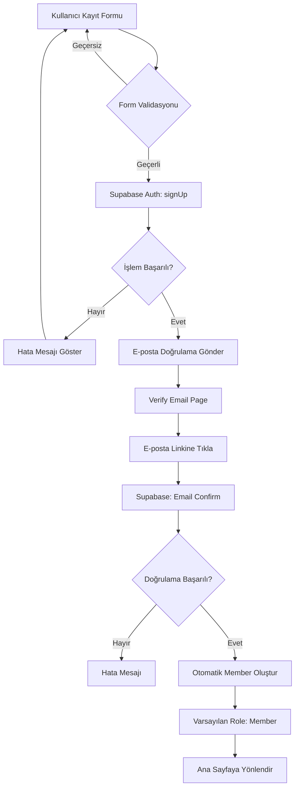
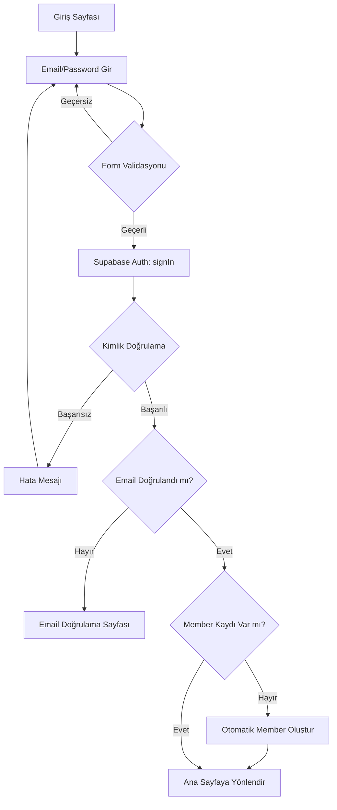
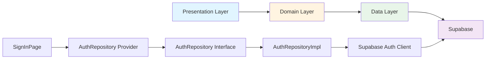

# Kimlik Doğrulama (Auth) Modülü

## Genel Bakış
FlowEdu uygulamasının kimlik doğrulama sistemini yöneten modüldür. Supabase Authentication kullanarak kullanıcı girişi, kayıt ve e-posta doğrulama işlemlerini gerçekleştirir.

## Özellikler
- ✅ E-posta/şifre ile giriş
- ✅ Kullanıcı kaydı
- ✅ E-posta doğrulama
- ✅ Otomatik member kaydı oluşturma
- ✅ Supabase Auth entegrasyonu

## Mimari Yapı

### Domain Layer
- **Entities**: Kullanıcı bilgileri için entity yapıları
- **Repositories**: `AuthRepository` interface

### Data Layer
- **Repository Implementation**: `AuthRepositoryImpl`
- **Supabase Integration**: Supabase Auth client kullanımı

### Presentation Layer
- **Pages**:
  - `sign_in_page.dart`: Giriş sayfası
  - `sign_up_page.dart`: Kayıt sayfası
  - `verify_email_page.dart`: E-posta doğrulama sayfası

## Kullanım

### Giriş Yapma
```dart
final authRepo = ref.read(authRepositoryProvider);
await authRepo.signInWithEmail(
  email: 'user@example.com',
  password: 'password123',
);
```

### Kayıt Olma
```dart
await authRepo.signUpWithEmail(
  email: 'user@example.com',
  password: 'password123',
);
```

### Çıkış Yapma
```dart
await authRepo.signOut();
```

## Otomatik Member Oluşturma
Kullanıcı kaydı veya girişi sırasında otomatik olarak `members` tablosuna kayıt oluşturulur. Varsayılan olarak "Member" rolü atanır.

## E-posta Şablonları
E-posta şablonları Supabase Dashboard'da yapılandırılmalıdır. Detaylar için `README.md` dosyasına bakın.

## Güvenlik
- Tüm kimlik doğrulama işlemleri Supabase Auth üzerinden yapılır
- Şifreler Supabase tarafından hash'lenir
- E-posta doğrulama zorunludur
- RLS politikaları ile veri güvenliği sağlanır

## Akış Diagramları

### Kullanıcı Kayıt Akışı


### Kullanıcı Giriş Akışı


### Clean Architecture Akışı


