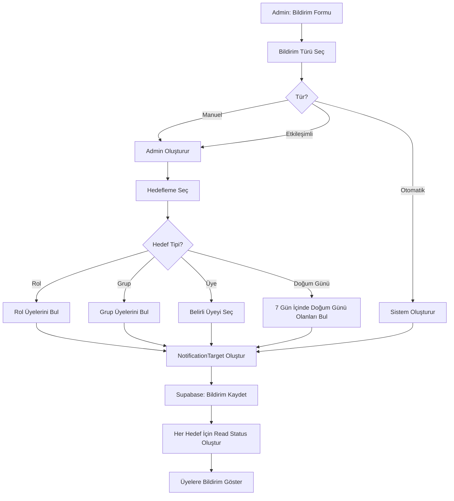
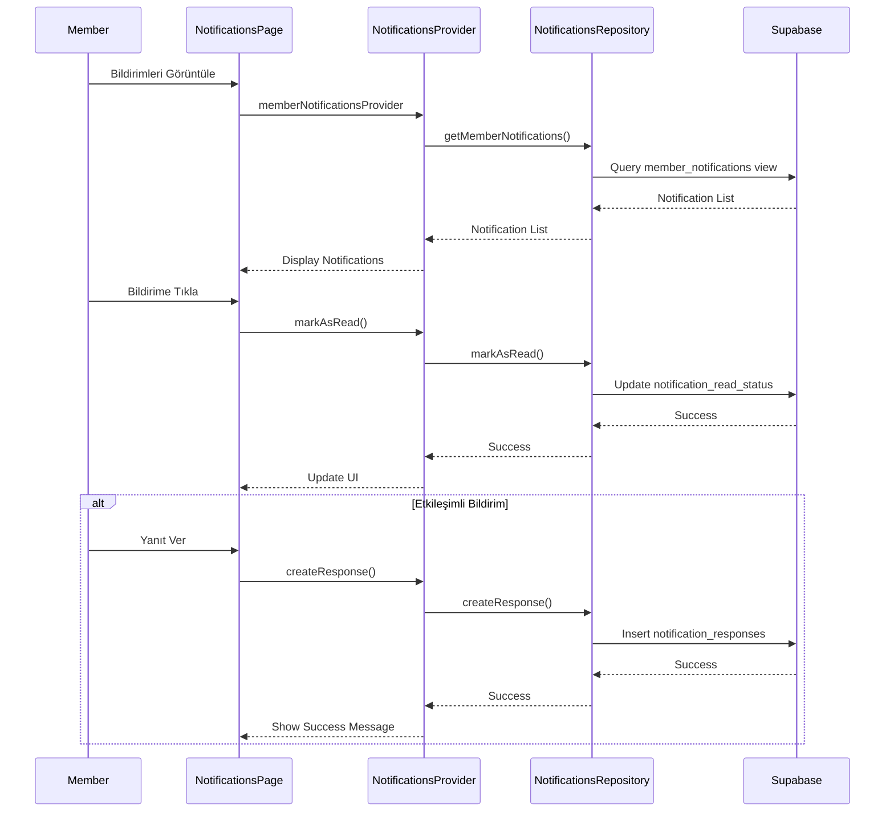
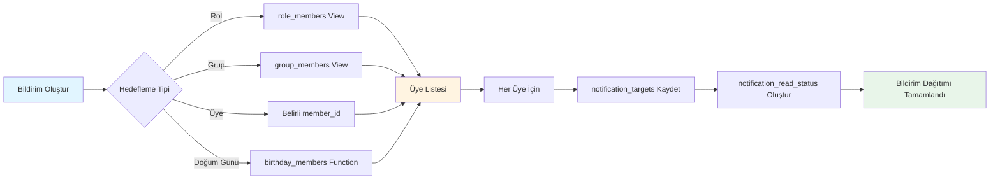
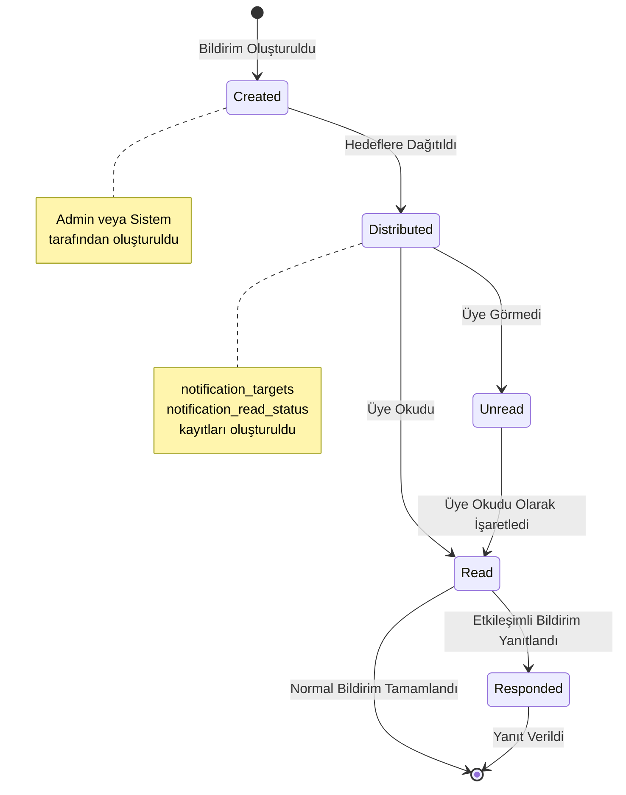

# Bildirimler (Notifications) Modülü

## Genel Bakış
Sistemdeki bildirim yönetim modülüdür. Admin kullanıcılar bildirim oluşturabilir, üyeler kendi bildirimlerini görüntüleyip yanıtlayabilir.

## Özellikler
- ✅ 3 Bildirim Türü:
  - **Otomatik**: Sistem tarafından otomatik oluşturulan bildirimler
  - **Manuel**: Admin tarafından manuel oluşturulan bildirimler
  - **Etkileşimli**: Üyelerin yanıt verebileceği bildirimler
- ✅ Hedefleme Sistemi:
  - Rol bazlı hedefleme
  - Grup bazlı hedefleme
  - Üye bazlı hedefleme
  - Doğum günü bazlı hedefleme
- ✅ Okuma durumu takibi
- ✅ Yanıt sistemi
- ✅ Responsive tasarım
- ✅ RLS politikaları

## Mimari Yapı

### Domain Layer
- **Entities**:
  - `Notification`: Ana bildirim entity
  - `NotificationTarget`: Hedefleme bilgisi
  - `NotificationResponse`: Yanıt bilgisi
- **Repositories**: `NotificationsRepository` interface
- **Use Cases**:
  - `GetNotifications`: Bildirimleri getir
  - `GetMemberNotifications`: Üye bildirimlerini getir
  - `CreateNotification`: Bildirim oluştur
  - `UpdateNotification`: Bildirim güncelle
  - `DeleteNotification`: Bildirim sil
  - `MarkAsRead`: Okundu olarak işaretle
  - `CreateResponse`: Yanıt oluştur

### Data Layer
- **Data Sources**: `NotificationsRemoteDataSource` (Supabase)
- **Models**: `NotificationModel`, `NotificationTargetModel`, `NotificationResponseModel`
- **Repositories**: `NotificationsRepositoryImpl`

### Presentation Layer
- **Pages**: `notifications_page.dart`
- **Widgets**:
  - `notification_card.dart`: Bildirim kartı widget'ı
  - `notification_form_dialog.dart`: Bildirim form dialog'u
  - `notification_response_dialog.dart`: Yanıt dialog'u
- **Providers**: `notifications_providers.dart` (Riverpod)

## Kullanım

### Bildirimleri Getirme
```dart
final notificationsAsync = ref.watch(memberNotificationsProvider);
```

### Yeni Bildirim Oluşturma
```dart
final createNotification = ref.read(createNotificationProvider);
await createNotification(
  title: 'Başlık',
  content: 'İçerik',
  type: NotificationType.manual,
  targets: [
    NotificationTarget(type: 'role', targetId: roleId),
  ],
);
```

### Okundu Olarak İşaretleme
```dart
final markAsRead = ref.read(markAsReadProvider);
await markAsRead(notificationId);
```

### Yanıt Verme
```dart
final createResponse = ref.read(createResponseProvider);
await createResponse(notificationId: notificationId, response: 'Yanıt metni');
```

## Veritabanı Yapısı
- **Tablo**: `notifications`
- **Kolonlar**:
  - `id`: UUID (Primary Key)
  - `title`: String
  - `content`: String
  - `type`: Enum (automatic, manual, interactive)
  - `created_by`: UUID
  - `created_at`: Timestamp

- **Tablo**: `notification_targets`
- **Kolonlar**:
  - `id`: UUID (Primary Key)
  - `notification_id`: UUID
  - `target_type`: String (role, group, member, birthday)
  - `target_id`: UUID (nullable for birthday)

- **Tablo**: `notification_read_status`
- **Kolonlar**:
  - `notification_id`: UUID
  - `member_id`: UUID
  - `is_read`: Boolean
  - `read_at`: Timestamp

- **Tablo**: `notification_responses`
- **Kolonlar**:
  - `id`: UUID (Primary Key)
  - `notification_id`: UUID
  - `member_id`: UUID
  - `response`: String
  - `created_at`: Timestamp

## Hedefleme Sistemi
Bildirimler 4 farklı yöntemle hedeflenebilir:
1. **Rol Bazlı**: Belirli role sahip üyelere gönderilir
2. **Grup Bazlı**: Belirli gruba gönderilir
3. **Üye Bazlı**: Belirli üyeye gönderilir
4. **Doğum Günü Bazlı**: Doğum günü yaklaşan üyelere gönderilir (7 gün içinde)

## Yetkilendirme
- **Admin**: Tüm bildirimleri oluşturabilir, görüntüleyebilir ve yönetebilir
- **Member**: Sadece kendi bildirimlerini görüntüleyebilir ve yanıtlayabilir

## RLS Politikaları
- Üyeler sadece kendilerine gönderilen bildirimleri görebilir
- Admin kullanıcılar tüm bildirimleri görebilir ve yönetebilir
- `member_notifications` view ile filtreleme yapılır

## Akış Diagramları

### Bildirim Oluşturma ve Dağıtım Akışı


### Bildirim Okuma ve Yanıt Akışı


### Hedefleme Sistemi Akışı


### Bildirim Türleri ve İş Akışı


