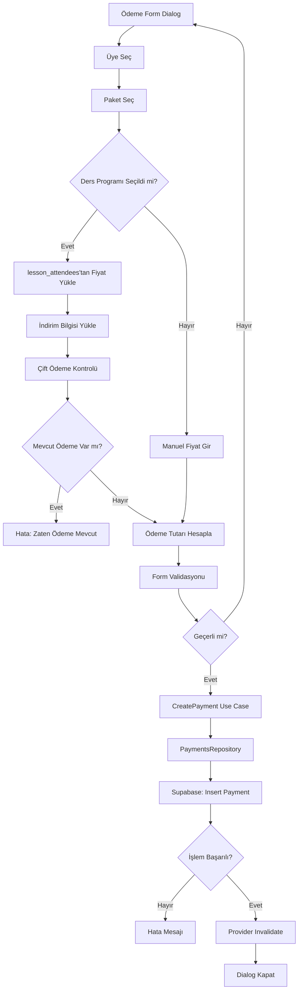
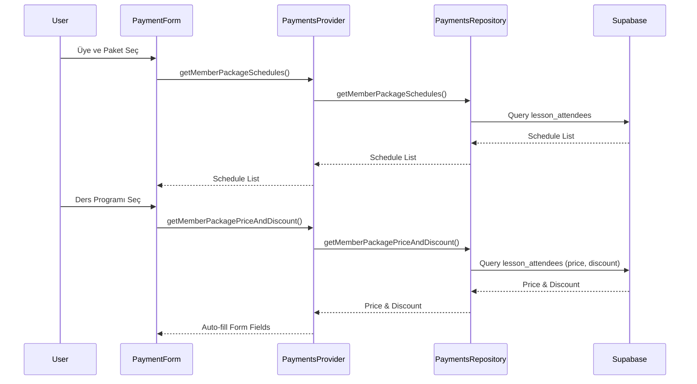
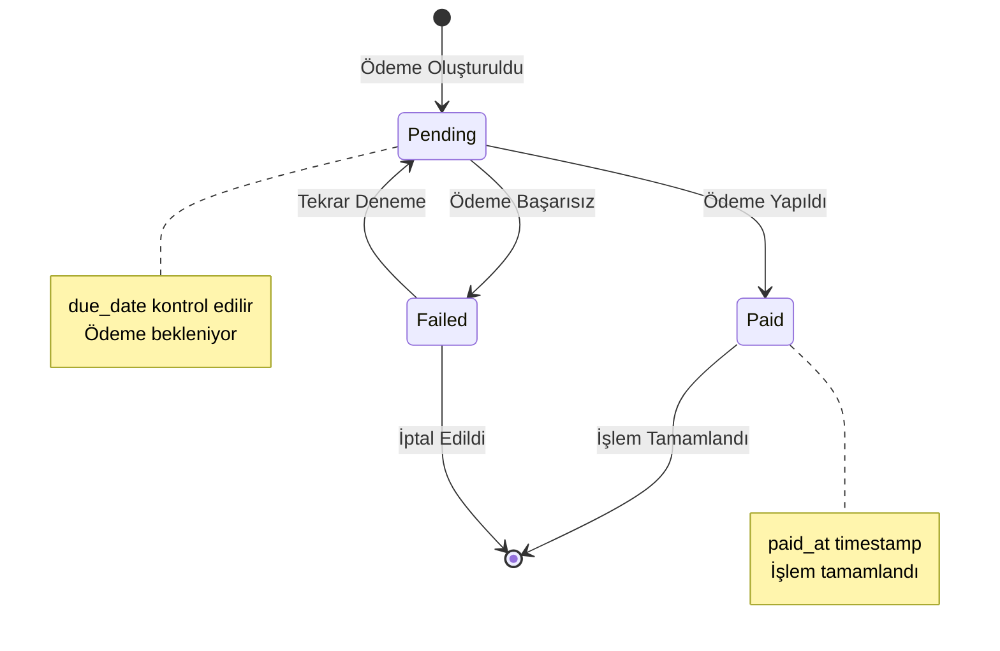
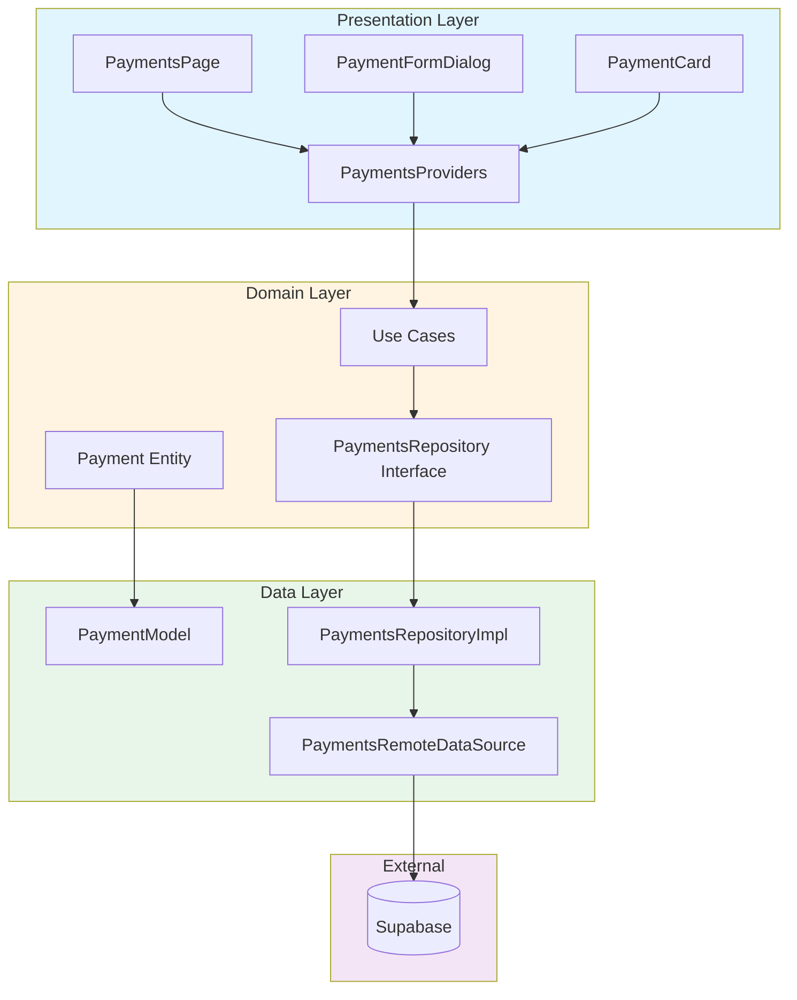

# Ödemeler (Payments) Modülü

## Genel Bakış
Sistemdeki ödeme yönetim modülüdür. Ödeme kayıtları, ders paketleri ve indirim yönetimi yapılır.

## Özellikler
- ✅ Ödeme CRUD işlemleri
- ✅ Ders paketi yönetimi
- ✅ İndirim sistemi (tutar veya yüzde bazlı)
- ✅ Ödeme durumu takibi (pending, paid, failed)
- ✅ Üye bazlı ödeme görüntüleme
- ✅ Ders programı entegrasyonu
- ✅ Otomatik fiyat ve indirim yükleme
- ✅ Çift ödeme kontrolü
- ✅ Filtreleme ve arama
- ✅ Responsive tasarım
- ✅ RLS politikaları

## Mimari Yapı

### Domain Layer
- **Entities**:
  - `Payment`: Ödeme entity
  - `LessonPackage`: Ders paketi entity
  - `PaymentWithDetails`: Detaylı ödeme bilgisi
- **Repositories**: `PaymentsRepository`
- **Use Cases**:
  - `GetPayments`: Ödemeleri getir
  - `CreatePayment`: Ödeme oluştur
  - `UpdatePayment`: Ödeme güncelle
  - `DeletePayment`: Ödeme sil
- **Repository Methods**:
  - `getMemberPackagePriceAndDiscount`: Üye-paket için fiyat ve indirim getir
  - `checkExistingPaymentForSchedule`: Çift ödeme kontrolü
  - `getMemberPackageSchedules`: Üye-paket için ders programlarını getir

### Data Layer
- **Data Sources**: `PaymentsRemoteDataSource` (Supabase)
- **Models**: `PaymentModel`, `LessonPackageModel`, `PaymentWithDetailsModel`
- **Repositories**: `PaymentsRepositoryImpl`

### Presentation Layer
- **Pages**:
  - `payments_page.dart`: Ödeme listesi sayfası
  - `lesson_packages_page.dart`: Ders paketleri sayfası
- **Widgets**:
  - `payment_card.dart`: Ödeme kartı widget'ı
  - `payment_form_dialog.dart`: Ödeme form dialog'u
  - `lesson_package_card.dart`: Paket kartı widget'ı
  - `lesson_package_form_dialog.dart`: Paket form dialog'u
- **Providers**: `payments_providers.dart` (Riverpod)

## Kullanım

### Ödemeleri Getirme
```dart
final paymentsAsync = ref.watch(paymentsWithDetailsProvider);
```

### Yeni Ödeme Oluşturma
```dart
final createPayment = ref.read(createPaymentProvider);
await createPayment(
  memberId: memberId,
  packageId: packageId,
  amount: 1000.0,
  discountAmount: 100.0,
  status: PaymentStatus.pending,
);
```

### Ödeme Güncelleme
```dart
final updatePayment = ref.read(updatePaymentProvider);
await updatePayment(
  payment.copyWith(status: PaymentStatus.paid, paidAt: DateTime.now()),
);
```

## Veritabanı Yapısı
- **Tablo**: `payments`
- **Kolonlar**:
  - `id`: UUID (Primary Key)
  - `member_id`: UUID
  - `package_id`: UUID
  - `amount`: Decimal (Toplam tutar)
  - `discount_amount`: Decimal (İndirim tutarı)
  - `status`: Enum (pending, paid, failed)
  - `due_date`: Date
  - `paid_at`: Timestamp
  - `created_at`: Timestamp

- **Tablo**: `lesson_packages`
- **Kolonlar**:
  - `id`: UUID (Primary Key)
  - `name`: String
  - `lesson_count`: Integer
  - `price`: Decimal
  - `is_active`: Boolean
  - `created_at`: Timestamp

## Ödeme Durumları
- **pending**: Bekleyen ödeme
- **paid**: Ödenmiş
- **failed**: Başarısız ödeme

## İndirim Sistemi
Her ödeme için indirim tutarı veya yüzdesi belirlenebilir:
- **Tutar Bazlı İndirim**: Sabit tutar indirimi
- **Yüzde Bazlı İndirim**: Yüzde oranında indirim
- Final tutar = `amount - discountAmount` formülü ile hesaplanır

## Ders Programı Entegrasyonu
Ödeme formunda ders programı seçilebilir:
- Üye ve paket seçildiğinde ilgili ders programları otomatik yüklenir
- Ders programı seçildiğinde fiyat ve indirim bilgileri otomatik doldurulur
- `lesson_attendees` tablosundan mevcut fiyat ve indirim bilgileri alınır
- Aynı üye-paket-schedule kombinasyonu için çift ödeme kontrolü yapılır

## Otomatik Fiyat Yükleme
Ödeme formunda:
1. Üye ve paket seçildiğinde ilgili ders programları listelenir
2. Ders programı seçildiğinde `lesson_attendees` tablosundan fiyat bilgisi yüklenir
3. Varsa indirim bilgisi (tutar veya yüzde) otomatik doldurulur
4. Başlangıç ve bitiş tarihleri otomatik set edilir

## Yetkilendirme
- **Admin**: Tüm ödemeleri görüntüleyebilir ve yönetebilir
- **Member**: Sadece kendi ödemelerini görüntüleyebilir

## RLS Politikaları
- Üyeler sadece kendi ödemelerini görebilir
- Admin kullanıcılar tüm ödemeleri görebilir ve yönetebilir
- `member_id` ile otomatik filtreleme yapılır

## Filtreleme ve Arama
- Grup bazlı filtreleme
- Üye bazlı filtreleme
- Paket bazlı filtreleme
- Durum bazlı filtreleme
- Tarih aralığı filtreleme

## Akış Diagramları

### Ödeme Oluşturma Akışı


### Otomatik Fiyat Yükleme Akışı


### Ödeme Durum Yönetimi


### Clean Architecture - Payments Modülü


